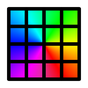

#  OpenRGB Visual Map Plugin

This is a plugin for [OpenRGB](https://gitlab.com/CalcProgrammer1/OpenRGB) that allows you to organize your real devices on a map and create a virtual devices (or many). You can then apply gradients (presets or custom), and expose it to an other plugin (eg. Effect Engine plugin).

## Features

* Drag and drop devices or LEDs on a resizable grid
* Register virtual controllers that can be used by other plugins
* Supports multiple virtual controllers at once
* Option to hide the member controllers so they don't conflict with the virtual controller

## Website

* Check out our website at [openrgb.org/plugin_visual_map](https://openrgb.org/plugin_visual_map.html)

## Supported Devices

* Supports any OpenRGB device that has Direct mode

## Installation

  * Pre-built binaries are available for the following platforms:
    * Windows
    * Linux (.so, .deb, and .rpm)
    * MacOS
  * Released versions are available to download on [OpenRGB.org](https://openrgb.org/plugin_visual_map.html).
  * Experimental (aka Pipeline) versions are available to download on [OpenRGB.org](https://openrgb.org/plugin_visual_map.html#pl).
  * The pre-built .so binaries are intended to be used with the OpenRGB AppImage builds and may not be compatible with OpenRGB installed from other sources.
  * Arch users can also install from the AUR for the [release](https://aur.archlinux.org/packages/openrgb-plugin-visual-map/) or [pipeline](https://aur.archlinux.org/packages/openrgb-plugin-visual-map-git/) version.

## Need Help?

Here is a link to find the documentation you need.

[VisualMap Help](https://gitlab.com/OpenRGBDevelopers/OpenRGB-Wiki/-/blob/stable/Plugins/VisualMap/VisualMap.md)
